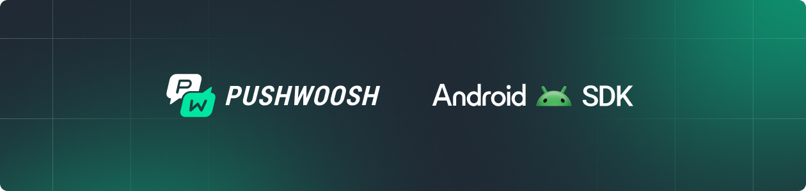

<p align="center">
  <a href="https://pushwoosh.github.io/pushwoosh-android-sdk/">
    
  </a>
</p>

<p align="center">
  <a href="https://central.sonatype.com/artifact/com.pushwoosh/pushwoosh"></a>
  <a href="https://developer.android.com/about/versions/marshmallow"></a>
  <a href="https://www.java.com"></a>
  <a href="LICENSE"></a>
</p>

<p align="center">
  Android SDK for the <a href="https://www.pushwoosh.com/">Pushwoosh</a> customer engagement platform.<br>
  Turn user data into high-converting campaigns with push notifications, in-app messages, and omnichannel customer journeys.
</p>

## Features

### Messaging Channels
- **Push Notifications** — Rich push with images, buttons, sounds, and deep links
- **In-App Messages** — Targeted in-app content triggered by events or segments
- **Message Inbox** — Persistent message center with ready-to-use UI components
- **Local Notifications** — Schedule on-device notifications without server round-trips

### User Data & Targeting
- **Tags & Events** — Collect user attributes and track in-app behavior for server-side segmentation
- **Geolocation & Geozones** — Location-aware triggers and geo-targeted campaigns
- **Cross-Device Identity** — Single user profile across devices and sessions via User ID

### Platform Integration
- **Campaign Automation** — SDK events and user data feed into Pushwoosh Customer Journey Builder for automated cross-channel campaigns
- **Real-Time Segmentation** — User attributes and events sent from the SDK are available for behavioral segmentation and RFM analysis on the platform
- **Analytics** — Delivery tracking, open rates, and conversion metrics

### Push Transport Providers
- **Firebase Cloud Messaging (FCM)** — Google Play devices
- **Huawei Mobile Services (HMS)** — Huawei devices without Google Play

## Quick Start

Place `google-services.json` from Firebase Console into your `app/` folder, then add to your app-level `build.gradle`:

```groovy
plugins {
    id 'com.google.gms.google-services'
}

dependencies {
    implementation 'com.pushwoosh:pushwoosh-firebase:6.7.62'
}
```

Configure `AndroidManifest.xml`:

```xml
<meta-data android:name="com.pushwoosh.appid" android:value="YOUR-APP-CODE" />
<meta-data android:name="com.pushwoosh.apitoken" android:value="YOUR-DEVICE-API-TOKEN" />
```

> **No manual initialization required** — the SDK auto-initializes on app startup via ContentProvider. Just call the API from anywhere.

Register for push notifications:

```java
Pushwoosh.getInstance().registerForPushNotifications();
```

## Documentation

- [pushwoosh.github.io/pushwoosh-android-sdk](https://pushwoosh.github.io/pushwoosh-android-sdk) – API reference for all SDK modules with Javadoc, quick start, and per-module entry points
- [docs.pushwoosh.com](https://docs.pushwoosh.com/platform-docs/pushwoosh-sdk/android-push-notifications) – Integration guides for FCM, HMS, ADM, SDK customization, and troubleshooting
- [pushwoosh-android-sample](https://github.com/Pushwoosh/pushwoosh-android-sample) – Working demo app (Java + Kotlin) with registration, tags, events, and Live Updates

## AI-Assisted Integration

Integrate the SDK using AI coding assistants (Claude Code, Cursor, GitHub Copilot, etc.).

> **Prerequisite:** Your AI assistant needs access to [Context7](https://context7.com/) MCP server or web search.

<details open>
<summary><b>Basic SDK Integration</b></summary>

```
Integrate Pushwoosh Android SDK into my Android project with Firebase Cloud Messaging (FCM).

Requirements:
- Add gradle dependencies (pushwoosh, pushwoosh-firebase)
- Configure AndroidManifest.xml with Pushwoosh App ID: YOUR_APP_ID
- Register for push notifications in MainActivity

Use Context7 MCP to fetch Pushwoosh Android SDK documentation.
```

</details>

<details>
<summary><b>Custom Push Notification Logic</b></summary>

```
Show me how to handle push notification callbacks (receive, open) with Pushwoosh SDK
in Android. I want to add analytics tracking for these events.

Use Context7 MCP to fetch Pushwoosh Android SDK documentation for NotificationServiceExtension.
```

</details>

<details>
<summary><b>User Segmentation with Tags</b></summary>

```
Show me how to use Pushwoosh tags for user segmentation in Android.
Create example helper class with methods for setting and getting tags.

Use Context7 MCP to fetch Pushwoosh Android SDK documentation for setTags and getTags.
```

</details>

## Support

- 📖 [Documentation](https://docs.pushwoosh.com/)
- 💬 [Support Portal](https://www.pushwoosh.com/contact-us)
- 🐛 [Report Issues](https://github.com/Pushwoosh/pushwoosh-android-sdk/issues)

## License

Pushwoosh Android SDK is available under a custom MIT-based license. See [LICENSE](LICENSE) for details.

---

Made with ❤️ by [Pushwoosh](https://www.pushwoosh.com/)
